# AW_Hell
Unity Game  Project (Level Generator)

My very first C# unity project, that is not based on a tutorial. All my own code.

First step of the process. Developing the tools. It will be a 1meter grid on with controlnodes, which will be replaced by art assets on level initialisation.
I want the levels to be truly random and not just big assets stuck together differently. Each of the 7 levels shall also be very different from all the others, so each one gets its own algorithm.

The first will be rooms on stilts over a red hot soup of lava and bodyparts (all very lighthearted, but still gross)
the rooms are connected by bridges and the whole structure is broken. 

heres some update on the generator for level 2, which will be a maze. Something like a dark march before you finally reach the gates of hell.

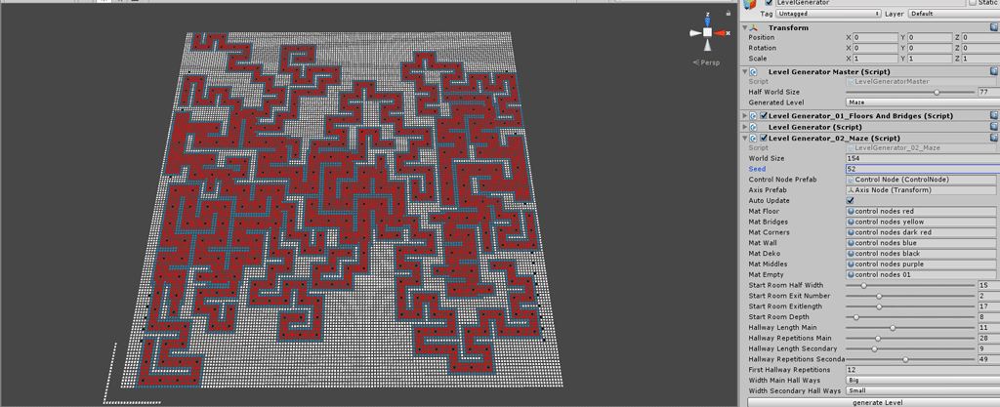

almost finnished with the hallways. Still want to add some rooms to the center of the maze and connect the two systems.

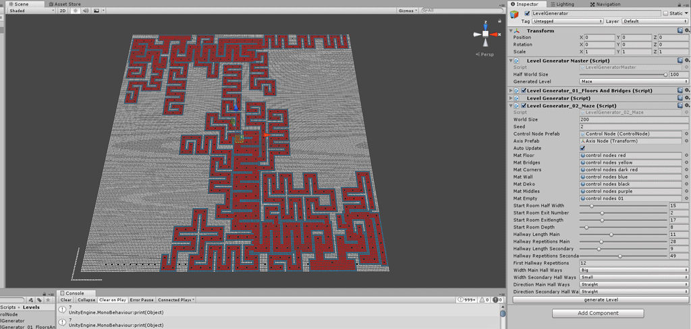

now with columns along the hallways and rooms to break it all up a bit.

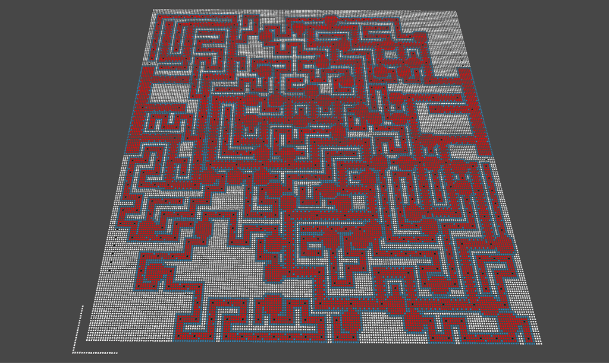
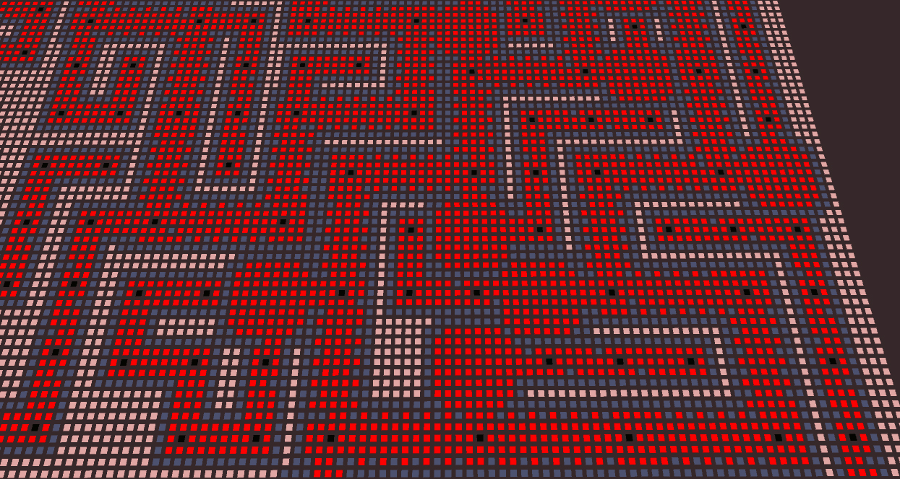

heres an update with big round rooms, on per maze entrance. I will add another one with a destinctice shape and then move on to more decoration elements.

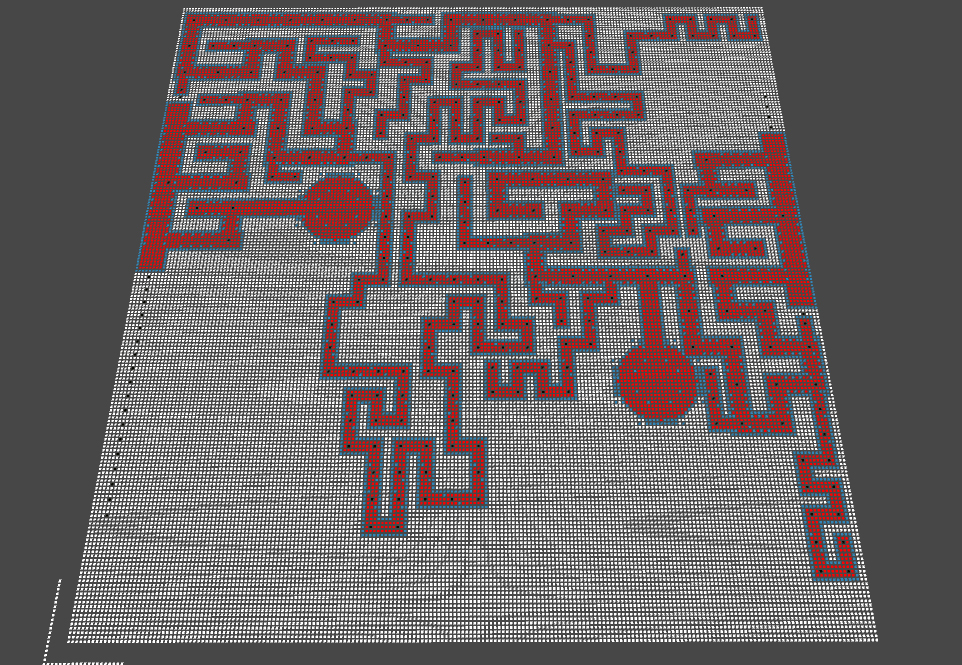

and the chapel

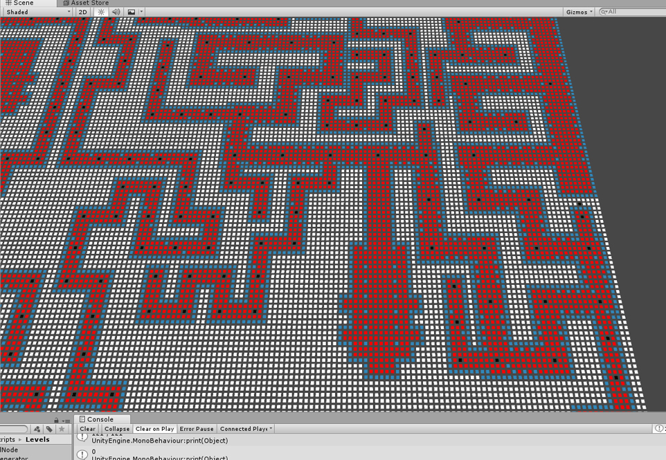

I will use this to start implementing collision objects, and later on the actual art assets.

So first I will need for loops to go through all the nodes and find big rectangular shapes of the smae node and then place collision objects there.

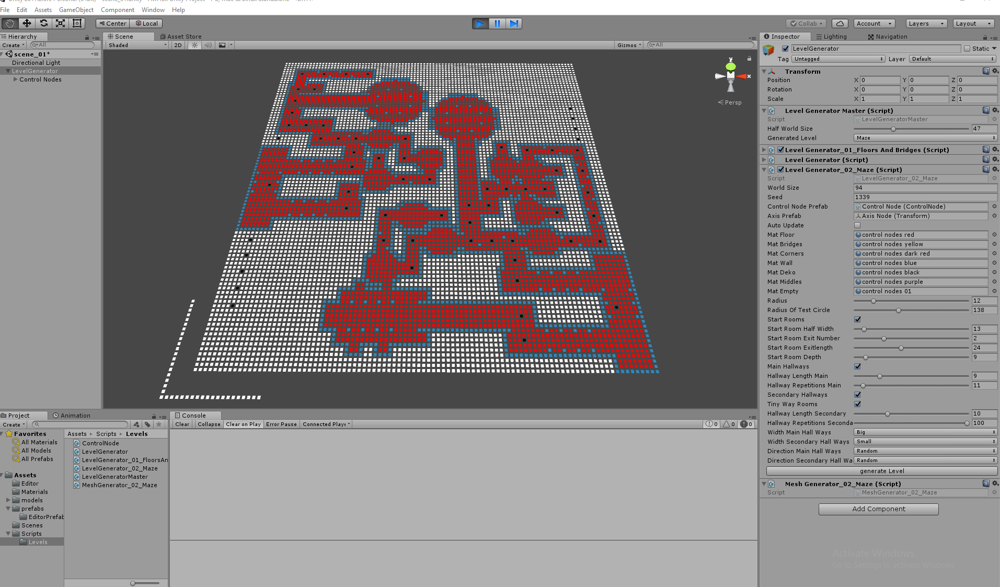

starting with implementing the collision objects. Very simple loop to check for consistent areas and then places a boxCollider consistend with the Tilestate. Blue is walls, red is floors and white is off limits(for now)

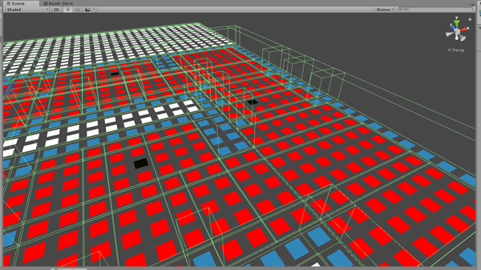

first shot of instantiated geometry. For now I only have 3 prefabs. One wall, one floorTile and one void field. Its just set per tile and its as simple as it goes. 

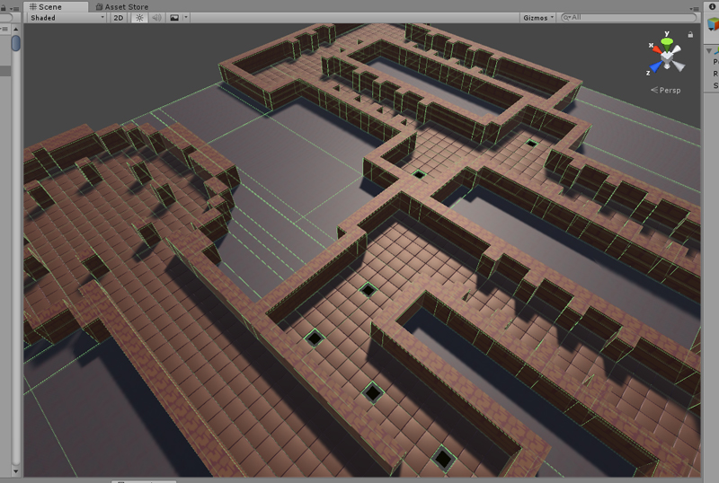

-------------------------------------------

here some shots of code refactoring:  
before:

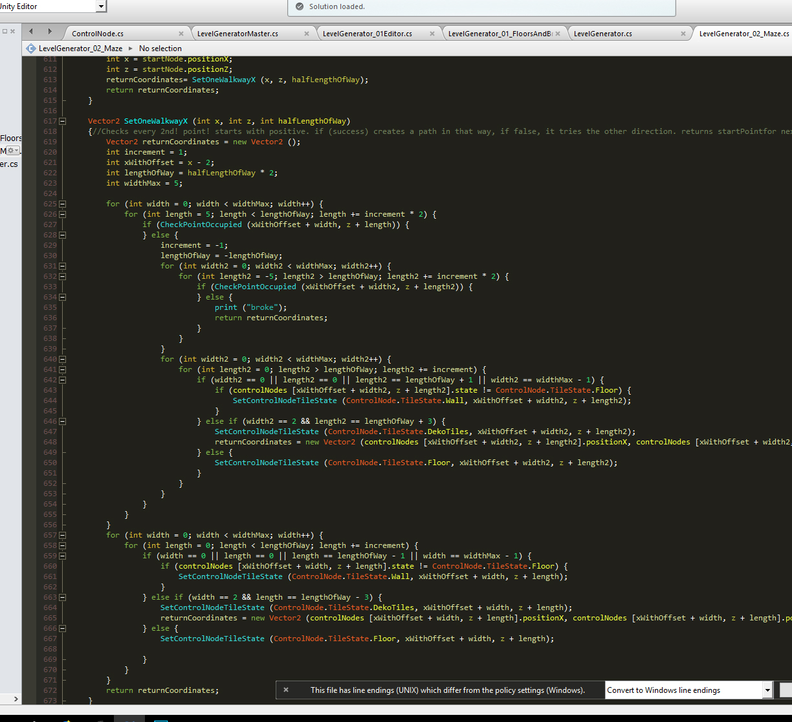

after:

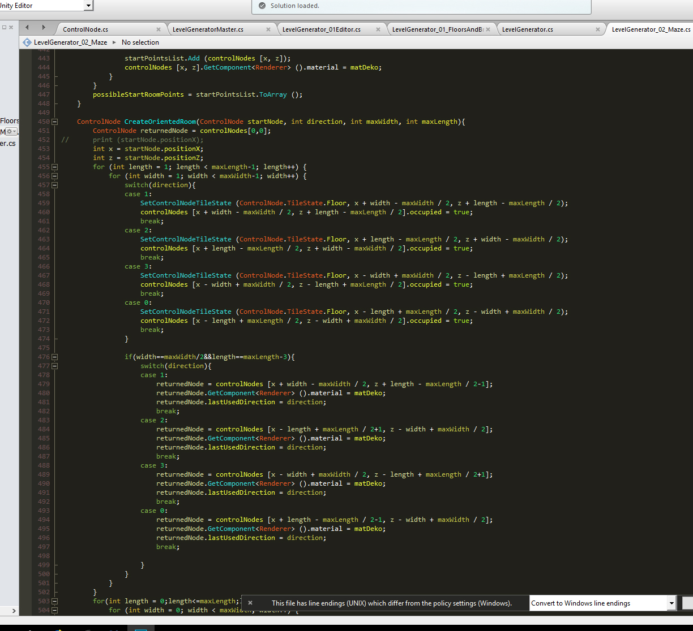

